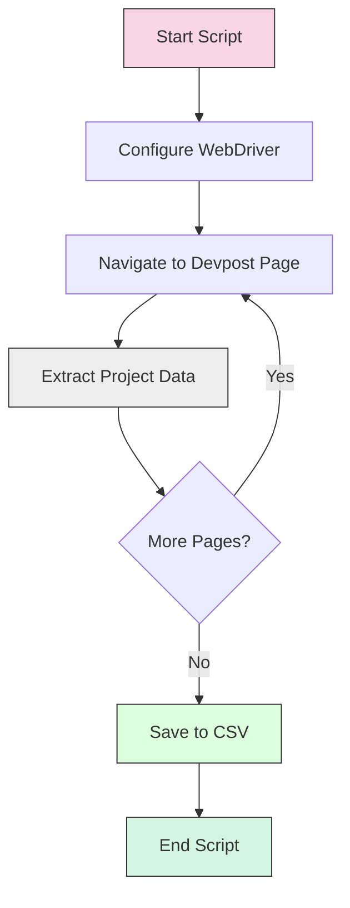

# 🚀 Devpost Hackathon Project Scraper

<div align="center">
  
  
  
</div>

## 📋 Overview

This Python script utilizes Selenium to automatically scrape hackathon project data from Devpost gallery pages. It extracts essential information about each project, including:

- 📝 Project name
- 📄 Project description
- 🔗 Project link

The collected data is saved to CSV files for easy analysis and reference.

## 🧩 How It Works



## 🛠️ Installation

### Prerequisites

1. **ChromeDriver**: 
   - Download and install ChromeDriver compatible with your Chrome version
   - Add the ChromeDriver executable to your system's PATH

2. **Python Packages**:
   ```bash
   pip install selenium pandas
   ```

<blockquote>
<p>💡 <strong>Note:</strong> Make sure your ChromeDriver version matches your installed Chrome browser version.</p>
</blockquote>

## 🚀 Usage

### Option 1: Single Devpost Domain

Run the script and enter a Devpost domain when prompted:

```bash
python app.py
```

Example interaction:
```
Enter your Devpost domain: ai-devsummit-2024-hackathon
Page 1 scraped. 32 projects found.
Page 2 scraped. 32 projects found.
...
Scraping completed. 96 projects found in 25.42 seconds.
```

### Option 2: Multiple Devpost Domains

1. Create a text file named `devpost.txt` with one domain per line:
   ```
   hacksharks
   ai-artathon
   ai-devsummit-2024-hackathon
   ...
   ```

2. Run the shell script:
   ```bash
   ./run_app.sh
   ```

   This script will process each domain in sequence.

## 📊 Data Output

The script generates CSV files with the following format:

| Name | Description | Link |
|------|-------------|------|
| Project 1 | Description of project 1 | https://devpost.com/... |
| Project 2 | Description of project 2 | https://devpost.com/... |
| ... | ... | ... |

### Example Output Files:
- `ai-devsummit-2024-hackathon_projects.csv`
- `hacksharks_projects.csv`

## ⚙️ Configuration Options

The script can be customized by modifying these components:

| Component | Description | Customization Options |
|-----------|-------------|----------------------|
| `options` | Chrome WebDriver options | Add/remove browser arguments |
| `extract_data()` | Data extraction function | Modify to extract additional fields |
| Sleep time | Wait period between page loads | Adjust `time.sleep(3)` value |
| Headless mode | Browser visibility | Toggle `--headless` option |

### Example Configuration Adjustment:

```python
# For visible browser (debugging)
options = webdriver.ChromeOptions()
# options.add_argument("--headless")  # Comment out for visible mode
```

## 🔍 Technical Details

### Core Components

<div align="center">
  <table>
    <tr>
      <th>Component</th>
      <th>Purpose</th>
    </tr>
    <tr>
      <td>🌐 <code>Selenium WebDriver</code></td>
      <td>Automates browser interaction and navigation</td>
    </tr>
    <tr>
      <td>📊 <code>Pandas</code></td>
      <td>Handles data organization and CSV export</td>
    </tr>
    <tr>
      <td>⏱️ <code>time</code> module</td>
      <td>Manages page loading delays and tracks execution time</td>
    </tr>
    <tr>
      <td>📜 <code>run_app.sh</code></td>
      <td>Batch processing script for multiple domains</td>
    </tr>
  </table>
</div>

### Script Execution Flow

1. **Initialization**: Configure WebDriver with headless mode and other options
2. **Navigation**: Access the Devpost gallery page for the specified domain
3. **Data Extraction**: Locate and extract project elements from the page
4. **Pagination**: Navigate through all available pages
5. **Data Export**: Save collected project information to CSV

## 🛡️ Dependencies

- **ChromeDriver**: WebDriver for Chrome browser automation
- **Selenium**: Python library for browser automation
- **Pandas**: Data manipulation and analysis library

## 📌 Best Practices

- ⏱️ The script includes a 3-second delay between page loads to respect server resources
- 🌐 Headless mode is enabled by default to minimize resource usage
- 🔄 Progress output keeps you informed about the scraping process
- 📊 Execution time is measured and reported for performance tracking

---

<div align="center">
  <p>📊 Collect hackathon project data efficiently and ethically</p>
  <p>Created by <a href="https://github.com/Yash-Kavaiya">Yash Kavaiya</a></p>
</div>
